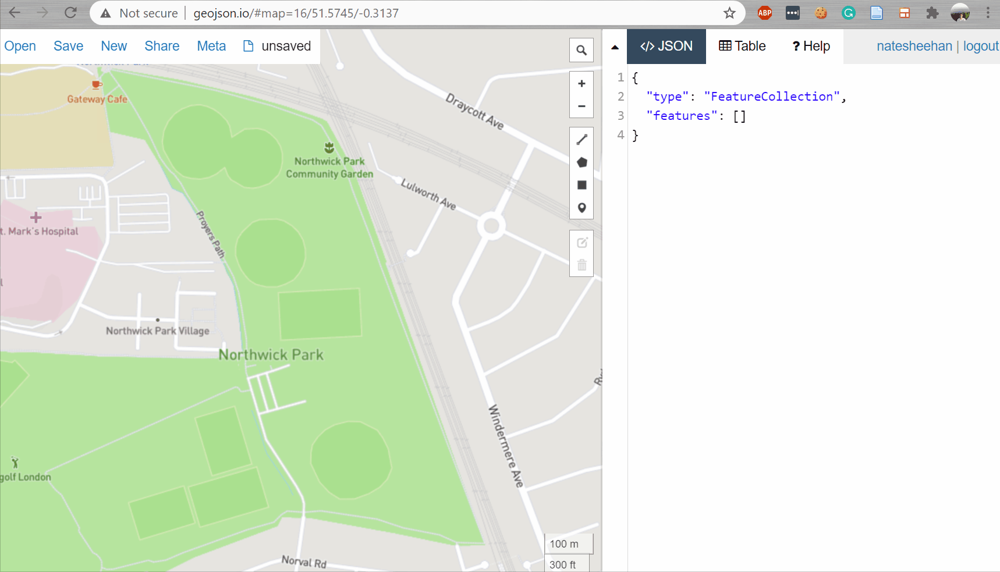
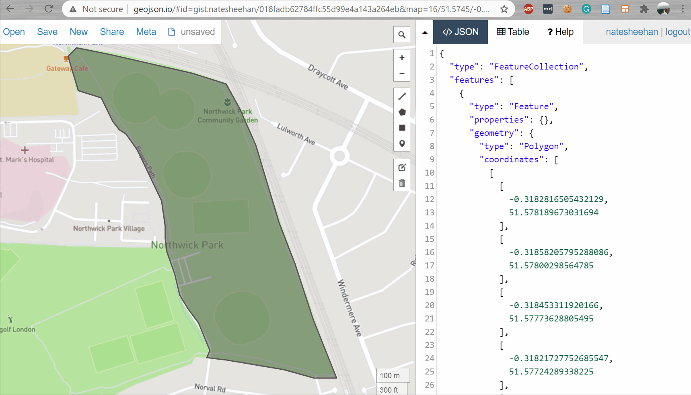
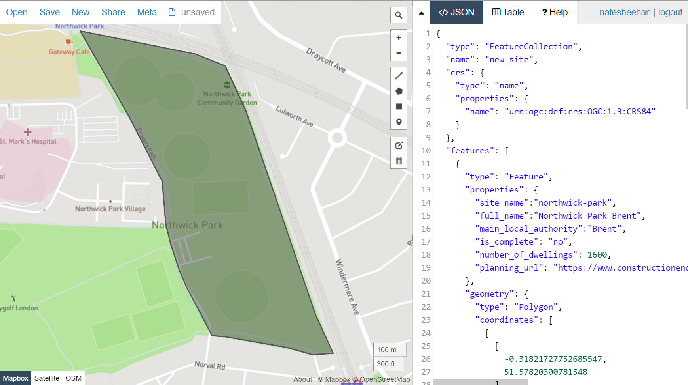
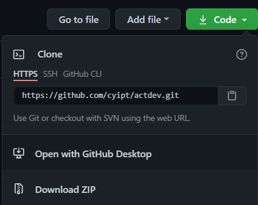

<title> Adding a new site to ActDev </title>

# Adding a new site to ActDev
#### Tutorial time: 10 minutes
#### Tutorial difficulty: Easy

# Section 1 Introduction 

ActDev is an emperical based web and data tool to enable planners, researchers and the general public to easily calculate active travel provision and potential. The project aims to boost local walking and cycling levels while preventing car dependency. Adding a new site to ActDev is truly very simple, even for those without coding experience. The following tutorial outlines each step in order to add a new site to the project using R and R-Studio, however, if the mere sight of code and a terminal petrify you, please create an [https://github.com/cyipt/actdev/issues](issue) on our Github and one of our maintainers will happily assist you.


## 1.1 Learning outcomes:

By the end of this tutorial you should be able to:

- Understand how the ActDev data science Tool functions
- Load and undertake analysis for a new housing site
- Submit a pull request to add the new site to the [https://actdev.cyipt.bike/](ActDev web tool)


## 1.2 Prerequisites:

Before continuing with this tutorial, please ensure you have the following:

- A [https://github.com/](GitHub) account
- R and R-Studio installed on your local machine

*If you are new to R, please follow this [https://rstudio-education.github.io/hopr/starting.html](tutorial)*


## 1.3 Who is the tool for? 

The ActDev tools is for **everyone**. ActDev is open source and has a small community of researchers and programmers who maintain it regularly. The ActDev web tool is built for, but not limited to:

- Planners who are working on new housing developments
- Local governments who are interested in the active transport provision of their constituency
- The inquisitive general public who wish to know more about a housing development, possibly before purchase


# Section 2 Adding a new site

### 2.1 Outlining a new site with GeoJSON

For those unfamiliar with GeoJSON, it is simply an open standard format which represents simple geographical features and their non-spatial attributes. The ActDev project makes use of GeoJSON in order to automate analysis and visualization. 

In order to add a new site to ActDev, a GeoJSON file matching the ActDev schema is needed. By definition, the ActDev schema is composed of three core elements: ```co-ordinate reference system```,```non-spatial features``` and ```geometry```. An example of the ActDev schema can be found below:

<details>
<summary> <b>Example of ActDev GeoJSON Schema</b> </summary>

```json
{
  "type": "FeatureCollection",
  "name": "new_site",
  "crs": {
    "type": "name",
    "properties": {
      "name": "urn:ogc:def:crs:OGC:1.3:CRS84"
    }
  },
  "features": [{
    "type": "Feature",
    "properties": {
      "site_name": "exeter-red-cow-village",
      "full_name": "Exeter Red Cow Village (Liveable Exeter)",
      "main_local_authority": "Mid Devon",
      "is_complete": "no",
      "dwellings_when_complete": 664.0,
      "planning_url": "https://www.liveableexeter.co.uk/garden-communities/garden-communities/red-cow-village/"
    },
    "geometry": {
      "type": "Polygon",
      "coordinates": [
        [
          [-3.543820381164551, 50.734567435695219],
          [-3.543562889099121, 50.733385886087575],
          [-3.543412685394287, 50.732720402498096],
          [-3.543219566345215, 50.732190725128717],
          [-3.542940616607666, 50.731688205164716],
          [-3.542768955230713, 50.731484479319221],
          [-3.54257583618164, 50.73103627934033],
          [-3.542060852050781, 50.730737476971974],
          [-3.54182481765747, 50.73047941884731],
          [-3.541781902313232, 50.730139866517433],
          [-3.541395664215088, 50.729936133938146],
          [-3.541116714477539, 50.729610159968296],
          [-3.540816307067871, 50.729352095633558],
          [-3.540515899658203, 50.729352095633558],
          [-3.539292812347412, 50.729555830752815],
          [-3.538906574249267, 50.729623742262341],
          [-3.539228439331055, 50.730167030794412],
          [-3.539443016052246, 50.730547329017952],
          [-3.539614677429199, 50.731022697455842],
          [-3.539915084838867, 50.731294334397361],
          [-3.540365695953369, 50.731633878359197],
          [-3.541095256805419, 50.732122817340489],
          [-3.541867733001709, 50.732815472161164],
          [-3.542361259460449, 50.733263655116687],
          [-3.542790412902832, 50.733576022519415],
          [-3.543305397033691, 50.734105684224097],
          [-3.543820381164551, 50.734567435695219]
        ]
      ]
    }
  }]
}
```

</details>
</br>

To kick things off, go to [GeoJSON.io](http://geojson.io/) and create a polygon of your site.




Awesome, we now have the geometry for our site. Next we should add the non-spatial attributes to the properties feature in the GeoJSON. We can do this using the [GeoJSON.io](http://geojson.io/) editor on the right hand side. The non-spatial attributes we need to add are:

- ```site_name``` (name of the site in lowercase, using - as spaces)
- ```full_name``` (full name of the site)
- ```main_local_authority``` (primary local authority the site is located in)
- ```is_complete``` (Is the site complete, partially complete, or not complete)
- ```dwellings_when_complete``` (total number of dwellings once the site is complete)
- ```planning_url``` (link to the planning url of the site)




Nearly there! Finally we need to specify a co-ordinate reference system. To do this, you can copy the first nine lines from the schema and paste it at the top of your file just before ```"features": [``` . Once this is done your editor should look something like this:



If it does, great, hover over the save button on the left hand side of [GeoJSON.io](http://geojson.io/) and click on the ```GeoJSON``` option. 

Once your file is downloaded, please refer back to the schema to ensure the file is following the specification.


### Step 2) Cloning the ActDev project

The [ActDev](https://github.com/cyipt/actdev) repository obtains all of the scripts and datasets necessary to add a new site. There are various ways to clone the [repository](https://github.com/cyipt/actdev):

- git terminal

```bash
git clone https://github.com/cyipt/actdev.git
```

- GitHub Desktop



Once downloaded, open the ActDev R-Studio project on your machine and navigate to the ```build.r``` file. Now, go ahead and move your downloaded GeoJSON file to the ```actdev``` folder.


# Step 3) Run analysis 

ActDev works through an ecosystem of R-Scripts that are respectively run through the ```build.r``` file.


Lets begin by running the first section of code. In this code chunk the build script loads the required libraries needed for analysis and initiates set up variables for the build. 

<details>
<summary> <b>First code chunk</b> </summary>
```r
# Aim: create geojson data for ui for all sites

library(tidyverse)
library(sf)
library(stplanr)
max_length = 20000 # maximum length of desire lines in m
household_size = 2.3 # mean UK household size at 2011 census
min_flow_routes = 10 # threshold above which OD pairs are included
region_buffer_dist = 2000
large_area_buffer = 500
new_site = TRUE
data_dir = "data-small" # for test sites
```
</details>
</br>
Next the build.r script loads all existing sites in the ActDev project.

<details>
<summary> <b>Second code chunk</b> </summary>
```r
# If new site has been added use the rbind version of sites
if(!exists("sites")){
  sites = sf::read_sf("data-small/all-sites.geojson")
}
```
</details>
</br>
Now its time to load in the newsite GeoJSON file. This chunk of code will load the GeoJSON file, transform it to include all columns needed for analysis, and then merge it with the existing data frame of sites. 

*Make sure to change* ```site = sf::read_sf("new_site.geojson")``` *to your filename* 

<details>
<summary> <b>Third code chunk</b> </summary>
```r
if(new_site) {
  # read-in new site that must have the following fields (NAs allowed):
  # dwellings_when_complete, site_name and full_name are necessary
  # [1] "site_name"               "full_name"               "main_local_authority"   
  # [4] "is_complete"             "dwellings_when_complete" "planning_url"           
  # [7] "geometry"  
  site = sf::read_sf("new_site.geojson") # change this to the file name you downloaded from geojson.io
  site_names_to_build = site$site_name
  path = file.path(data_dir, site_names_to_build)
  dir.create(path)
  new_cols = sf::st_drop_geometry(sites[1, ])
  new_cols = new_cols[setdiff(names(sites), names(site))]
  new_cols[] = NA
  sites = rbind(
    sites,
    sf::st_sf(
      cbind(sf::st_drop_geometry(site), new_cols),
      geometry = site$geometry
      )
  )
} else {
  site_names_to_build = sites %>% 
    filter(str_detect(string = site_name, pattern = "regex-to-rebuild"))
}
```
</details>
</br>
After completion, you should be able to see your new site at the bottom of the ```sites``` data object.
Before you are able to run the analysis you will need to run the ```build-setup.r``` script, this will load all of the neccesary datasets, libraries and variables needed to run the analysis. This will take a few minutes.

<details>
<summary> <b>Fourth code chunk</b> </summary>
```r
source("code/build-setup.R") # national data
```
</details>
</br>
Following this, the analysis begins. To start with run the following chunks to create commute OD desire lines for the site and  calculate journey time statistics for the site and its neighboring LSOAs. This should take a minute or so.

<details>
<summary> <b>Fifth code chunk</b> </summary>
```r
# build aggregate scenarios ----------------------------------------------
set.seed(2021) # reproducibility
disaggregate_desire_lines = FALSE

for(site_name in site_names_to_build) {
  message("Building for ", site_name)
  suppressMessages({
    suppressWarnings({
      source("code/scenarios-streamlined.R")
    })
  })
}

# Add jts data ------------------------------------------------------------
for(site_name in site_names_to_build) {
  message("Building for ", site_name)
  suppressMessages({
    suppressWarnings({
      source("code/add_jts.R")
    })
  })
}
```
</details>
</br>
After completion, you are ready to run the next batch of scripts. However, **do not run** 

```r
# Add json files for abstreet ---------------------------------------------
# should the build process add a background traffic scenario? (WIP)
build_background_traffic = FALSE
# site_directories = list.dirs(data_dir)[-1]
# site_names_to_build = gsub(pattern = "data-small/", replacement = "", x = site_directories)
for(site_name in site_names_to_build) {
  message("Building for ", site_name)
  suppressMessages({
    suppressWarnings({
      source("code/abstr-scenarios.R")
    })
  })
}
```

as this has not been configured for new sites yet.

The next batch of scripts to run create zones, infographics, mode-split summary statistics and site metrics for your new site.

<details>
<summary> <b>Sixth code chunk</b> </summary>
```r
# Generate 'clockboard' data ----------------------------------------------

source("code/tests/color_palette.R")

for(site_name in site_names_to_build) {
  message("Building for ", site_name)
  suppressMessages({
    suppressWarnings({
      source("code/clockboard-zones.R")
    })
  })
}

# Generate infographics  ----------------------------------------------

for(site_name in site_names_to_build) {
  message("Building for ", site_name)
  suppressMessages({
    suppressWarnings({
      source("code/infographics.R")
    })
  })
}

# Generate mode split summary  ----------------------------------------------

for(site_name in site_names_to_build) {
  message("Building for ", site_name)
  suppressMessages({
    suppressWarnings({
      source("code/mode-split-summary.R")
    })
  })
}

# Generate in site metrics  ----------------------------------------------

for(site_name in site_names_to_build) {
  message("Building for ", site_name)
  suppressMessages({
    suppressWarnings({
      source("code/in-site-metrics.R")
    })
  })
}


# Populate site metrics for new site --------------------------------------

if(new_site){
  source("code/site-metrics.R")
}
```
</details>
</br>
Tada! Analysis complete!. 

In your global environment you should find an object called ```sites_join``` which contains all new sites, including  your new site. The table should be populated with the respective empirical data from the analysis. 

You should also see a new folder in ```actdev/data-small``` with your sites name, this folder should contain 31 items. 

### Step 3) Create pull request

Given everything has run smoothly, you can now submit a pull-request to add the site to the ActDev project. Using either the git terminal or GitHub Desktop push your changes.

Once pushed, return back to the [https://github.com/cyipt/actdev/issues](ActDev GitHub) where you should see a **Create Pull Request** button.  

# Section 5 Final remarks 
